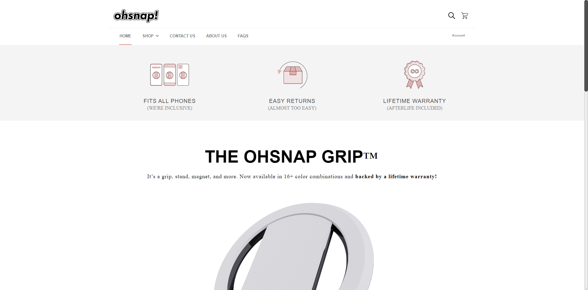
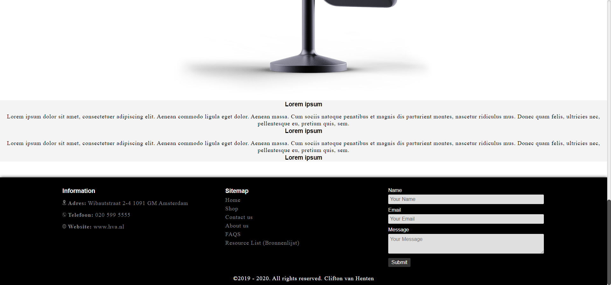

# Procesverslag
**Auteur:** Clifton van Henten

Markdown cheat cheet: [Hulp bij het schrijven van Markdown](https://github.com/adam-p/markdown-here/wiki/Markdown-Cheatsheet). Nb. de standaardstructuur en de spartaanse opmaak zijn helemaal prima. Het gaat om de inhoud van je procesverslag. Besteedt de tijd voor pracht en praal aan je website.

Website: http://217.123.119.144/fed/

## Bronnenlijst
1. https://ohsnap.com/
2. -bron 2-
3. -...-

## Eindgesprek (week 7/8)

-dit ging goed & dit was lastig-

**Screenshot(s):**

-screenshot(s) van je eindresultaat-

## Voortgang 3 (week 6)

-same as voortgang 1-

## Voortgang 2 (week 5)

Bij dit voortgangsgesprek had ik niet genoeg om een beoordeling kunnen krijgen, dit was omdat ik niet had gewerkt aan FeD wegens persoonlijke omstandigheden. Ik heb hier wel uitgelegd dat ik een inhaalsprint ga maken, zodat ik bij de eindbeoordeling het eindresultaat af heb.

Ik vroeg om feedback om de manier waarop ik de code had geschreven. Dit was volgens het team goed en ik kon hiermee doorgaan. Wel werd hier aangegeven dat sommige HTML5 elementen niet op de goede plaatst stonden. Dit was bijvoorbeeld; Section > Article > Section. Dit was fout. De reden hiervan was dat dit semantisch niet correct is, elke section die je plaatst moet een Titel bevatten. Wanneer dit niet het geval is, moet je gaan overwegen of het gebruik van een section op die plek wel de juiste is.

Dit zal ik ook aanpassen om een meer semantische website op te kunnen leveren. 

Ik heb achteraf bij de voortgangsgesprekken veel geleerd en feedback gekregen, die ik kan toepassen om een beter eindresultaat te leveren.

Ik heb er dus voor gekozen om mijn website volledig van scratch weer te maken, en een nieuwe folder te beginnen waarin niks aanwezig is.

## Voortgang 1 (week 3)

### Stand van zaken

Ik heb de homepage nagemaakt, hierin ondervond ik geen problemen met de positionering en hoe de elementen eruit moesten komen te zien.

Ik heb hier feedback op terug gekregen dat de manier waarop ik de website ontworp niet de juiste manier is. Tegenwoordig focussen bedrijven zich op Mobile First, dit doen ze omdat het grote aantal gebruikers op telefoon de website moet kunnen bekijken. Het is niet persé verkeerd om niet Mobile first te werken, maar dit zal het wel makkelijker maken wanneer je naar groter beeld moet gaan schalen.

**Screenshot(s):**

### Agenda voor meeting

We hebben samen in ons groepje besproken om de volgende punten aan bot te laten komen:

- Hoe krijg ik NOS's manier van responsive voor elkaar met coderen? (dingen komen en dingen verdwijnen met het schalen) 
- Wat kan ik op mijn site met Javascript gaan doen?
- Hoe laat ik de "tour de france" foto inzoomen op zichzelf bij en hoover maar ervoor zorgen dat niet de height en width veranderen?

### Verslag van meeting

- We hebben alles besproken wat er besproken was, er kwam hier ook aan bod dat ik andere studenten al had geholpen met hun websites. Dus sommige vragen hoefde niet behandeld te worden.
Dit was bijvoorbeeld de laatste vraag.

## Intake (week 1)

**Je startniveau:** Zwart

**Je focus:** Surface Plane en Responsiveness

**Je opdracht:** https://ohsnap.com/

**Screenshot(s):**

**Breakdown-schets(en):**

