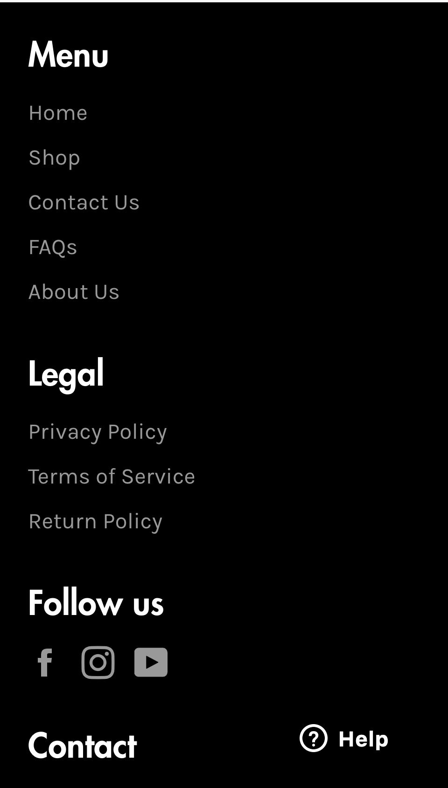
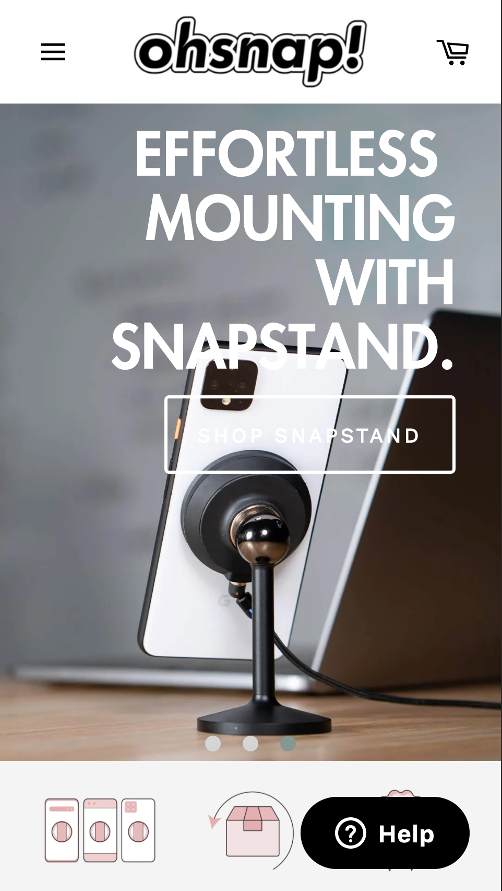

# Procesverslag
**Auteur:** Clifton van Henten

Markdown cheat cheet: [Hulp bij het schrijven van Markdown](https://github.com/adam-p/markdown-here/wiki/Markdown-Cheatsheet). Nb. de standaardstructuur en de spartaanse opmaak zijn helemaal prima. Het gaat om de inhoud van je procesverslag. Besteedt de tijd voor pracht en praal aan je website.

Website: http://217.123.119.144/fed/

## Bronnenlijst
1. -bron 1-
2. -bron 2-
3. -...-

## Eindgesprek (week 7/8)

-dit ging goed & dit was lastig-

**Screenshot(s):**

-screenshot(s) van je eindresultaat-

## Voortgang 3 (week 6)

-same as voortgang 1-

## Voortgang 2 (week 5)

-same as voortgang 1-

## Voortgang 1 (week 3)

### Stand van zaken

Heb tot nu toe de website nagemaakt, en dat ging hartstikke goed. Ik had geen moeite met de positionering van de elementen.

**Screenshot(s):**

-screenshot(s) van hoe ver je bent-

### Agenda voor meeting

We hebben samen in ons groepje besproken om de volgende punten aan bot te laten komen:

- Hoe krijg ik NOS's manier van responsive voor elkaar met coderen? (dingen komen en dingen verdwijnen met het schalen) 
- Wat kan ik op mijn site met Javascript gaan doen?
- Hoe laat ik de "tour de france" foto inzoomen op zichzelf bij en hoover maar ervoor zorgen dat niet de height en width veranderen?

### Verslag van meeting

- 

## Intake (week 1)

**Je startniveau:** Zwart

**Je focus:** Surface Plane en Responsiveness

**Je opdracht:** https://ohsnap.com/

**Screenshot(s):**

**Breakdown-schets(en):**

